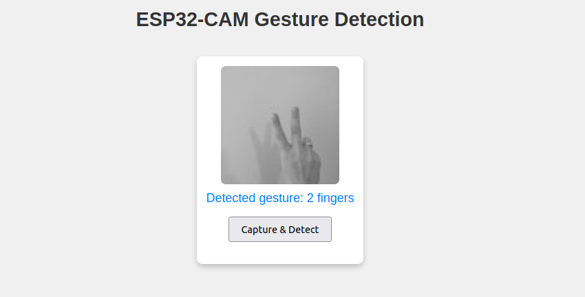
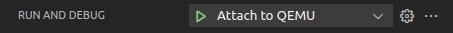
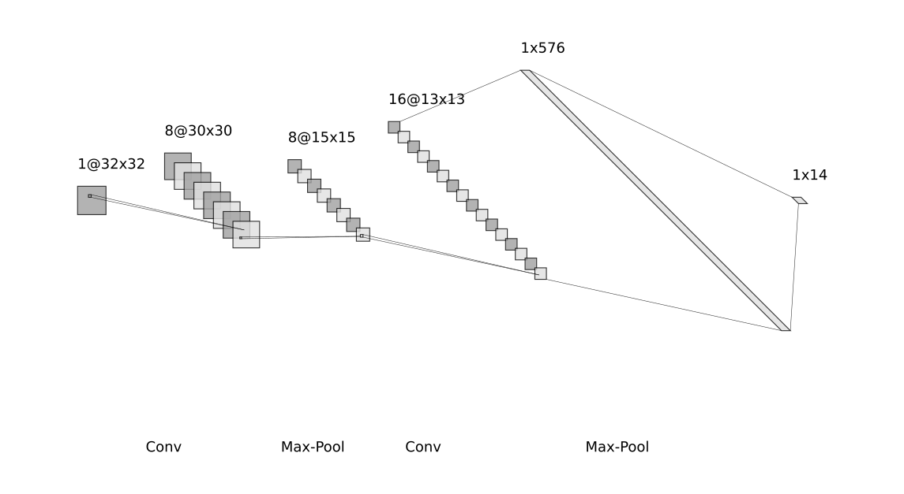

# 🤘 ESP32 Gesture Recognition

**Real-time hand gesture recognition** on the **ESP32-CAM** using **TensorFlow Lite**. Includes **Web Interface** to see the camera feed and the recognised gesture.


## ⚡ Installation & Build

### What You'll Need

* [ESP-IDF](https://docs.espressif.com/projects/esp-idf/en/latest/esp32/get-started/index.html) - The official development framework for ESP32.
* ESP32-CAM board
* Micro USB cable
* QEMU (optional, for local simulation)  

### Building and Flashing

1.  **Clone the repo:**
    ```bash
    git clone git@github.com:annapanfil/gesture_recognition.git
    cd gesture_recognition
    ```

1.  **Build, Flash, and Go!**

    It will install all the prerequisites (from CMake and idf) automatically if you don't have them.
    ```bash
    source ~/esp/v5.0.8/esp-idf/export.sh
    idf.py build flash
    ```

    Replace the path with actual path where you've installed esp-idf.

1.  **See it running:**
    ```bash
    idf.py monitor
    ```

1. **Set up the Wi-Fi credentials**

    When you log to the Wi-Fi for the first time, a qr code for Wi-Fi provisioning will be displayed on the device serial port. You need to scan it with an official Espressif Provisioning tool. The application is available for both [android](https://play.google.com/store/apps/details?id=com.espressif.provsoftap) and [ios](https://apps.apple.com/in/app/esp-softap-provisioning/id1474040630).

    For the next launches, the Wi-Fi credentials will be remembered and stored on NVS partition on the device.

    
    
    
1. **Use the web interface:**
    1.  Make sure your computer is on the same Wi-Fi network as your ESP32.
    2.  Open your web browser and go to the IP address of your ESP32 (check the serial monitor for the address).
    3.  You'll see a simple web page. Click the "Capture & Detect" button and show it your best gestures!

    
    
### Flashing on QEMU
The program can be also run in QEMU emulator for debugging purposes. To open it like this follow these steps:
1. Select `CONFIG_ENABLE_QEMU_DEBUG=y` and `CONFIG_ETH_USE_OPENETH=y` in `idf.py menuconfig`

2. Run QEMU with `idf.py run-qemu`. Press ctrl+A,X to exit the emulator.

3. Debug on QEMU (in vscode)
    1. Install [vscode extension for gdb](https://marketplace.visualstudio.com/items?itemName=webfreak.debug)

    1. Add `GDB: Connect to gdb server` (modified) configuration to `.vscode/launch.json`:

        ```json
        {
        "type": "gdb",
        "gdbpath": "/home/anna/.espressif/tools/xtensa-esp-elf-gdb/12.1_20231023/xtensa-esp-elf-gdb/bin/xtensa-esp32-elf-gdb",
        "request": "attach",
        "name": "Attach to QEMU",
        "executable": "${workspaceFolder}/build/gestures.elf",
        "target": ":1234",
        "remote": true,
        "cwd": "${workspaceRoot}",
        "valuesFormatting": "parseText"
        },
        ```

        Find the gdb path with: `which xtensa-esp32-elf-gdb`. If it's not available, install it with `idf_tools.py install xtensa-esp32-elf-gdb`

    1. Set the breakpoints

    1. Run the emulator in debug mode with `idf.py run-qemu-debug`. Press ctrl+A, X to exit it.

    1. Go to Run & Debug, choose "Attach to QEMU" run and debug.
        

## Gestures
The model recognises 14 gestures:


## 🔧 Insides 

📂 Project Structure
```
gesture_recognition/
├── include/        # Header files
├── main/           # Main source files
├── models/         # Model file (trained, quantised and exported to tflite)
├── scripts/        # Python scripts for model training and conversion
├── tools/          # Dockerfile for CI/CD
├── CMakeLists.txt
└── partitions.csv  # Custom partitioning
```

## CNN Model
The CNN model processes grayscale images of size 32×32 pixels. It consists of two convolutional layers with channel progression 1 → 8 → 16, each followed by batch normalization, ReLU activation, and max pooling. The feature maps are then flattened and passed through a fully connected layer, which outputs the predicted gesture class.


If you want to train your own model, the training script is ready in `scripts/train.py`.

## Data flow

Camera → Preprocess (normalise and resize) → TensorFlow Lite → Web UI

<!-- ## 🚀 Performance
- Inference time: ...
- Memory usage: ...
- Accuracy: ...
- Latency: ... -->

## Memory management

Model and tensor arena are kept in **PSRAM**, because of their size (250KB and 30KB).

**Stack size** for main task was increased to 16KB for model, camera and wi-fi initialisation.

### Custom Flash memory partitioning
`NVS`: Reduced from 24KB → 16KB (needed only for WiFi credential)</br>
`phy_init`: Kept at 4KB (ESP32 requirement)</br>
`factory`: Increased from 1MB → 1.6MB (to fit TensorFlow model + application code)</br>
Free: 0.4MB


<!-- TODO  shemat jak komponenty współpracują (ESP, web GUI, dioda, mosquito) -->

---
© Anna Panfil 2025